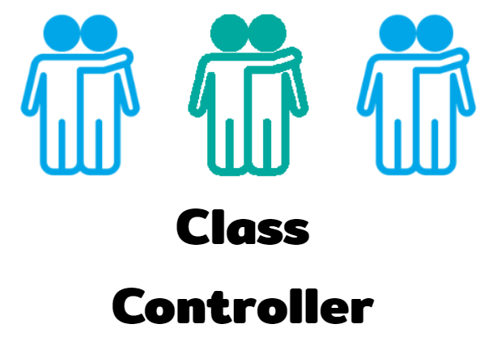
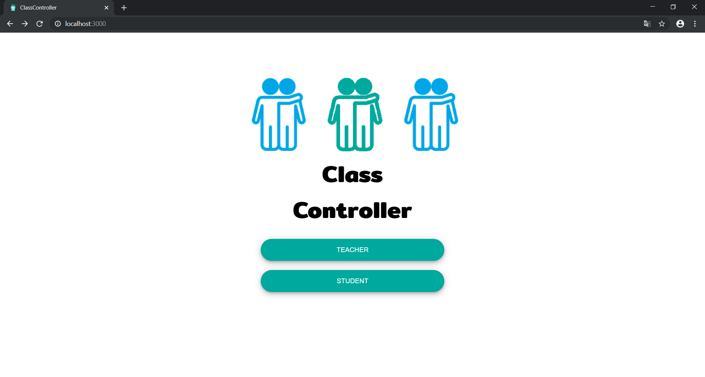
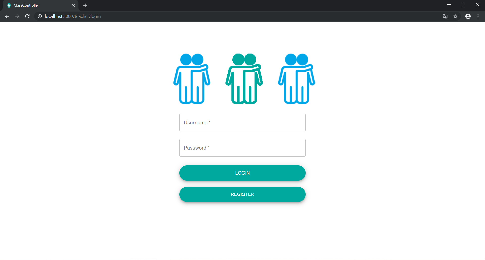
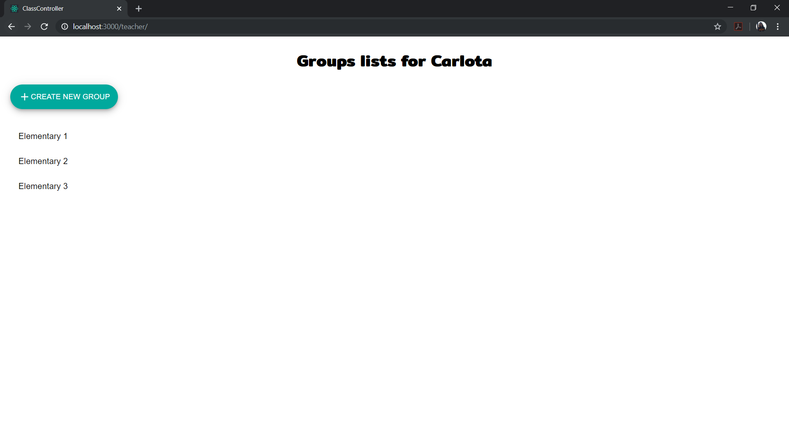
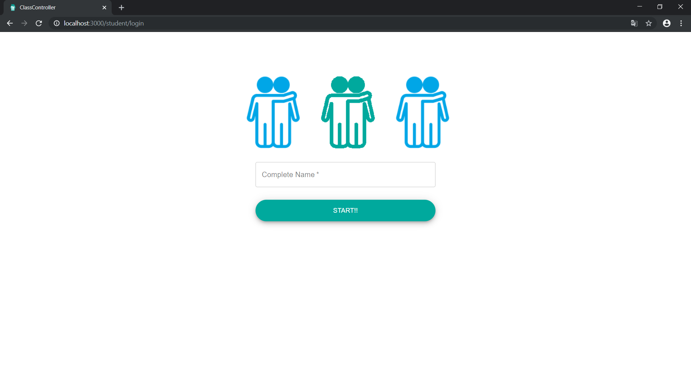
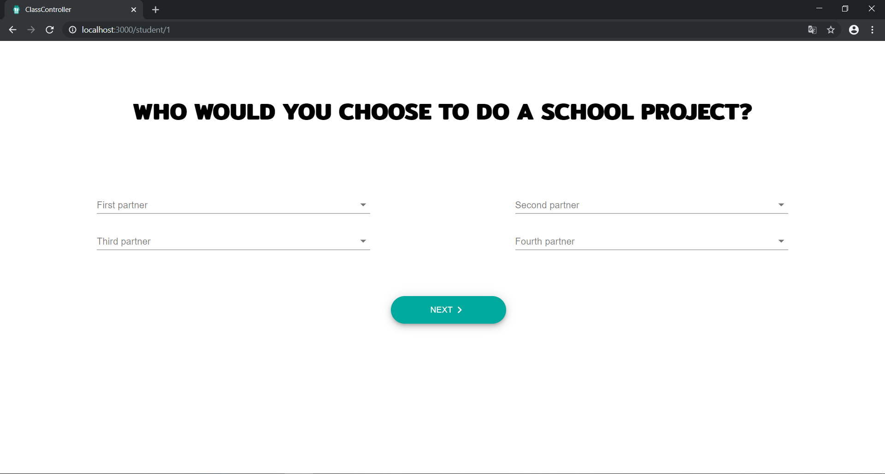
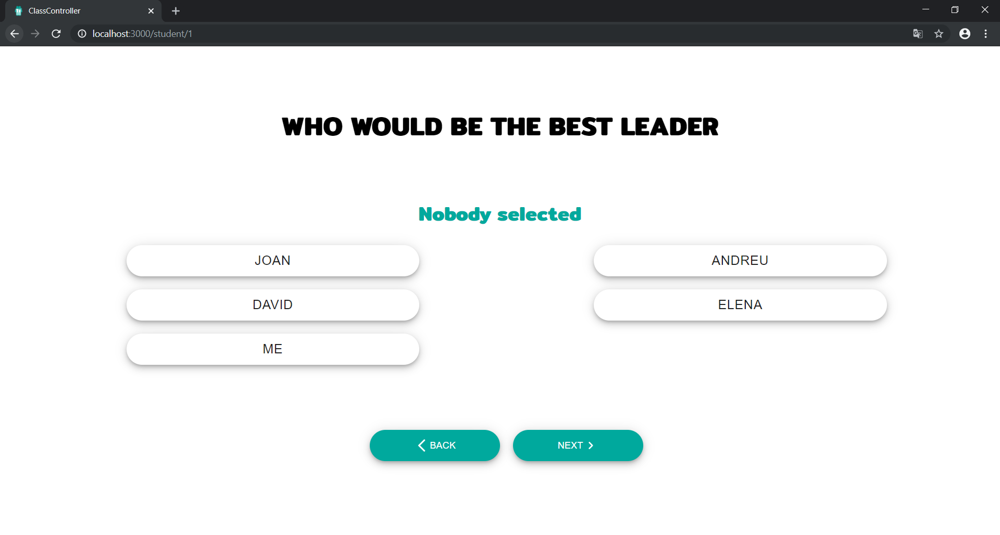
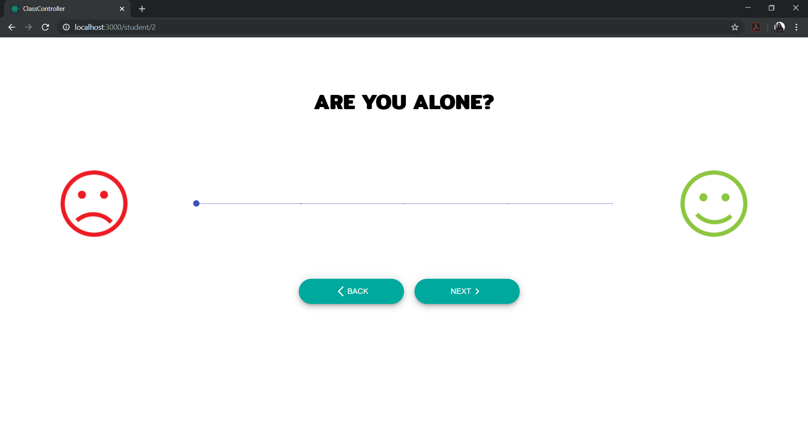

<br>
<p align="center">
  
</p>
<br>

[](https://GitHub.com/carlotacb/ClassController/stargazers/)
[](https://GitHub.com/carlotacb/ClassController/network/)
[](https://github.com/carlotacb/easycam)
[](https://GitHub.com/carlotacb/ClassController/graphs/contributors/)
[](https://github.com/carlotacb/ClassController/blob/master/LICENSE)

## Devpost description of the project

### Inspiration

Bullying in schools is a reality, and some of us, we used to see (or be part) of some of these unacceptable situacions. Also we hear about some projects and papers that talk a about how to prevent this situations on the psicologic way, and after take a lot on them we realize that if all the proces is automatized we can prevent all the situations in a easier way and making the study with more frequency.

### What it does

ClassController helps the teacher to detect which students are alone and witch ones are the leaders of the class. For these, the students need to answer a bunch of questions, and after that, the teacher would visualize which student is seen as a leader for the rest of the group or which one is the person that is beeing bullied.

### How we built it

For the **Front-End** we use _React.js_ (using _JavaScript_) with _Material UI_ for the components and _Sigma.js_ for the graph visualization.

For the **Back-End** we use _Golang_ for the development of the endpoints and _MySQL_ for the database.

### Challenges we ran into

During the development of this project we learn how to make a backend in Golang, and during the learn proces we have some issues that we solve, learning the lenguages in a 24-hackathon is always a challenge! Also we didn't know anything about the graph and we have the bottleneck with the development of the graph and also with the visualization of it.

### Accomplishments that we're proud of

We are very proud of all the project in general! Finishing the web on time and developing more than the MVP we think at the beggining of the hackathon. We had a good architecture and a coordination in the team. It was one of the best hackathons, just because the project was ended with more than the expected and ON TIME!

### What we learned

For the **back-end** (as we commented in the _challenge_ part) we learn to do a backend in Golang, also we learn about Gorm.

For the **front-end** we learn about Material UI for the design of the web and also we learn about graph visualization.

In **general** we learn about comunication inside the team.

### What's next for class control

In the next vesions of ClassControl we think that the questions can be personalized and also the AI algorithm can be better and detect the people, for their leadership and for their loneliness, and create notifications and messages to show the teacher without having to look in the graph

## Funcionalities and screenshots

First of all, when you open the aplication you need to choose your profile (student or teacher)
<br>
<p align="center">
  
</p>
<br>

### Teachers

1. **Login page**: The teacher needs to enter a username and a password to login the application, and if it doesn't have account, register.
    <br>
    <p align="center">
    
    </p>
    <br>

2. **Groups Page**: The teacher can see a list with all their groups, and also add groups on the list on it by entering a name and a list of students separated by comas. When a group is clicked, it goes to the dependency graph page.
    <br>
    <p align="center">
    
    </p>
    <br>

3. **Dependency graph**: The teacher can see a graph with the relations of the students, that it's generated by the responses of them. Also it can see the feelings of the student with the color of the node, red indicates sadnes, black is the neutral color, and green is happiness.

### Students

1. **Login page**: The student needs to enteer their complete name to start answering the questions.
    <br>
    <p align="center">
    
    </p>
    <br>

2. **Questions**: The student need to answer two type of questions: the first ones are questions were the students answers are related to the relations in class, and the second ones are related to their feelings.
    1. **Type 1 - Selection of multiple classmates**: The students can choose anyone in the classrom.
        <br>
        <p align="center">
        
        </p>
        <br>

    2. **Type 2 - Selection of one classmate**: The student have to choose betwen 3 or 4 classmates (depending on the previous answers).
        <br>
        <p align="center">
        
        </p>
        <br>

    3. **Type 3 - Rating**: The student have to rate selecting a number between 0 and 4.
        <br>
        <p align="center">
        
        </p>
        <br>

#### Questions

1. **Relations questions**
    1. *Type 1* <br/> Q: Who would you choose to do a school project? <br/> A: The student have to those 4 students
    2. *Type 2* <br/> Q: Who would be the best leader? <br/> A: The student have to choose one of the 4 students selected in the last question, or theirself]
    3. *Type 1* <br/> Q: Who would you choose to play at the playground? <br/> A: The student have to those 4 students
    4. *Type 1* <br/> Q: Who would you choose to be in an airplain cabin? <br/> A: The student have to those 2 students
    5. *Type 2* <br/> Q: Who would be the pilot? <br/> A: The student have to choose one of the 2 students selected in the last question, or theirself
    6. *Type 1* <br/> Q: Who would you believe most? <br/> A: The student have to those between 1 or 3 students
    7. *Type 1* <br/> Q: Who tell the best stories? <br/> A: The student have to those 3 students

2. **Feelings questions**
    1. *Type 3* <br/> Q: Are you happy? <br/> A: Number between 0 and 4
    2. *Type 3* <br/> Q: Are you alone? <br/> A: Number between 0 and 4
    3. *Type 3* <br/> Q: Are you happy playing at the playground? <br/> A: Number between 0 and 4
    4. *Type 3* <br/> Q: Do you like going to school? <br/> A: Number between 0 and 4
    5. *Type 3* <br/> Q: Are you happy with the friends you have? <br/> A: Number between 0 and 4

## Requirements

To run this application you need to have installed in you PC the following:

1. Node.js
2. Golang

## Usage

To run the application you need to run the first the backend and then frontend:

### Backend

1. First you need to go to the backend folder:

    ```bash
    cd backend
    ```

2. Install all the Golang dependencies:

    ```bash
    go build
    ```

3. Run the backend:

    ```bash
    ./backend
    ```

### Frontend

1. First you need to go to the frontend folder:

    ```bash
    cd ..
    cd frontend
    ```

2. Install all the node dependencies:

    ```bash
    npm install
    ```

3. Start the application:

    ```bash
    npm start
    ```

## Authors

- [Carlota Catot](https://github.com/carlotacb)
- [Andreu Gallofré](https://github.com/atsuky)
- [Victor Sanchez](https://github.com/sanchyy)
- [David Valero](https://github.com/dvm55)

## License

MIT © ClassController
